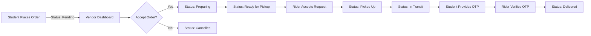

<!-- markdownlint-disable MD033 -->
# 🍔 Campus Food Delivery System (CFDS)

<div align="center">


**The ultimate food ordering and delivery platform tailored for university campuses.**

[](https://reactjs.org/)
[](https://www.typescriptlang.org/)
[](https://supabase.com/)
[](https://tailwindcss.com/)
[](LICENSE.md)
[](http://makeapullrequest.com)

[🚀 Live Demo](https://cfds-eta.vercel.app) • [📖 Documentation](#-table-of-contents) • [🐛 Report Bug](https://github.com/ubongar/campus-courier/issues) • [✨ Request Feature](https://github.com/ubongar/campus-courier/issues/new)

</div>

---

## 📑 Table of Contents

- [🍔 Campus Food Delivery System (CFDS)](#-campus-food-delivery-system-cfds)
  - [📑 Table of Contents](#-table-of-contents)
  - [🎯 Overview](#-overview)
    - [🚀 Why CFDS?](#-why-cfds)
  - [🌟 Key Features](#-key-features)
    - [👨‍🎓 Student Portal](#-student-portal)
    - [🏪 Vendor Portal](#-vendor-portal)
    - [🚴 Rider Portal](#-rider-portal)
    - [🛡️ Admin Portal](#️-admin-portal)
  - [🛠️ Tech Stack](#️-tech-stack)
    - [Frontend Architecture](#frontend-architecture)
    - [Backend \& Infrastructure](#backend--infrastructure)
  - [📂 Project Structure](#-project-structure)
  - [🚀 Getting Started](#-getting-started)
    - [Prerequisites](#prerequisites)
    - [📥 Installation](#-installation)
  - [🔐 Security \& Database](#-security--database)
  - [📱 User Flow Diagram](#-user-flow-diagram)
  - [📦 Deployment](#-deployment)
    - [Vercel (Recommended)](#vercel-recommended)
  - [🤝 Contributing](#-contributing)
  - [📊 Projected Roadmap](#-projected-roadmap)
  - [📄 License](#-license)
  - [👏 Acknowledgments](#-acknowledgments)
  - [📞 Support \& Contact](#-support--contact)

---

## 🎯 Overview

**CFDS** revolutionizes campus dining by seamlessly connecting students with campus vendors and reliable delivery riders. Built specifically for the dynamic environment of **Babcock University**, this platform ensures fast, efficient, and trackable food delivery with real-time updates, role-based dashboards, and a user-centric experience.

### 🚀 Why CFDS?

- ⚡ **Lightning Fast:** Real-time order tracking and instant notifications via WebSockets.
- 🎓 **Campus-Optimized:** Tailored routing and location services for university hostels and faculties.
- 💰 **Integrated Wallet:** Secure, hassle-free payment management with transaction history.
- 📱 **Mobile-First:** A responsive design that feels like a native app on all devices.
- 🔒 **Secure & Reliable:** Enterprise-grade security powered by Supabase Authentication and RLS.

---

## 🌟 Key Features

<!-- markdownlint-disable MD033 -->

### 👨‍🎓 Student Portal

<details>
<summary><b>Click to expand features</b></summary>

- **🔍 Browse & Search:** Explore campus vendors with advanced filtering by category (Fast Food, Traditional, Drinks, etc.).
- **🛒 Smart Cart:** Add items, customize orders with special instructions, and apply promo codes.
- **⏰ Scheduled Orders:** Pre-order meals for specific dates/times to skip the cafeteria queue.
- **📍 Real-time Tracking:** Live GPS tracking from the kitchen to your doorstep.
- **💳 Digital Wallet:** Add funds, view transaction history, and manage daily spending.
- **⭐ Reviews & Ratings:** Rate vendors and meals to build community trust.
- **🔔 Notifications:** Instant alerts for order confirmation, pickup, and arrival.
- **📜 Order History:** Access detailed receipts and re-order favorites easily.

</details>

### 🏪 Vendor Portal

<details>
<summary><b>Click to expand features</b></summary>

- **📊 Analytics Dashboard:** Monitor real-time revenue, popular items, and peak ordering times.
- **📝 Menu Management:** Full CRUD operations for menu items, including availability toggles and image uploads.
- **✅ Order Management:** A Kanban-style board to accept, prepare, and mark orders as ready.
- **🕐 Business Hours:** Configure operating hours to automatically open/close the digital store.
- **📸 Branding:** Customize shop profiles with logos, banners, and descriptions.
- **📢 Promotions:** Create special discount codes to boost sales during off-peak hours.

</details>

### 🚴 Rider Portal

<details>
<summary><b>Click to expand features</b></summary>

- **📦 Delivery Hub:** A "Gig" board to view and accept available delivery requests in the vicinity.
- **🗺️ GPS Navigation:** Integrated maps for optimal routes between vendors and hostels.
- **✅ Verified Delivery Flow:** 1.  **Accept:** Claim an order from the pool.
    2.  **Pickup:** Confirm receipt from the vendor.
    3.  **Deliver:** Verify delivery via a secure OTP provided by the student.
- **💵 Earnings Dashboard:** Track daily, weekly, and total earnings with withdrawal options.
- **🏆 Leaderboard:** Gamified performance metrics to encourage fast and safe deliveries.

</details>

### 🛡️ Admin Portal

<details>
<summary><b>Click to expand features</b></summary>

- **📊 System Overview:** High-level metrics (Total Users, GMV, Active Orders).
- **👥 User Management:** CRUD operations for Students, Vendors, and Riders (including verification).
- **📈 Advanced Analytics:** Visual charts for revenue trends and platform health.
- **🚨 Dispute Resolution:** Tools to handle complaints, issue refunds, and manage flagged accounts.
- **⚙️ System Settings:** Configure global platform settings and commission rates.

</details>

---

## 🛠️ Tech Stack

### Frontend Architecture

| Tech | Description |
| :--- | :--- |
| **React** | Component-based UI library for building interactive interfaces. |
| **TypeScript** | Static typing for enhanced code quality and developer experience. |
| **Tailwind CSS** | Utility-first CSS framework for rapid and responsive UI development. |
| **Vite** | Next-generation frontend tooling for lightning-fast builds. |
| **Framer Motion** | Production-ready animation library for React. |
| **TanStack Query** | Powerful asynchronous state management for server data. |
| **shadcn/ui** | Beautifully designed, accessible, and customizable components. |

### Backend & Infrastructure

| Tech | Description |
| :--- | :--- |
| **Supabase** | Open-source Firebase alternative providing Database, Auth, and Realtime. |
| **PostgreSQL** | Powerful, open-source object-relational database system. |
| **Vercel** | Platform for frontend frameworks and static sites, used for deployment. |

---

## 📂 Project Structure

```bash
campus-courier/
├── 📁 public/                  # Static assets (favicons, manifest)
├── 📁 src/
│   ├── 📁 assets/              # Images, icons, and global media
│   ├── 📁 components/          # Reusable UI components
│   │   ├── 📁 ui/              # shadcn/ui primitive components
│   │   ├── ProtectedRoute.tsx  # Auth guard wrapper
│   │   └── ...                 # Feature-specific components
│   ├── 📁 hooks/               # Custom React hooks (use-toast, use-mobile)
│   ├── 📁 integrations/        # Third-party SDKs (Supabase client)
│   ├── 📁 lib/                 # Utility functions (cn, formatters)
│   ├── 📁 pages/               # Application Routes/Views
│   │   ├── 📁 admin/           # Admin-specific pages
│   │   ├── 📁 rider/           # Rider-specific pages
│   │   ├── 📁 student/         # Student-specific pages
│   │   ├── 📁 vendor/          # Vendor-specific pages
│   │   ├── Auth.tsx            # Login/Signup logic
│   │   └── Index.tsx           # Landing page
│   ├── App.tsx                 # Main application router
│   └── main.tsx                # Entry point
├── 📁 supabase/
│   ├── 📁 migrations/          # SQL migrations for database schema
│   └── config.toml             # Local Supabase configuration
├── 📄 tailwind.config.ts       # Tailwind CSS configuration
├── 📄 vite.config.ts           # Vite bundler configuration
└── 📄 package.json             # Project dependencies and scripts
````

---

## 🚀 Getting Started

Follow these steps to set up the project locally.

### Prerequisites

- **Node.js** (v18 or higher)
- **npm** or **bun**
- **Git**
- A **Supabase** project (Free tier works great)

### 📥 Installation

1. **Clone the Repository**

    ```bash
    git clone [https://github.com/ubongar/campus-courier.git](https://github.com/ubongar/campus-courier.git)
    cd campus-courier
    ```

2. **Install Dependencies**

    ```bash
    npm install
    # or
    bun install
    ```

3. **Environment Configuration**
    Create a `.env` file in the root directory:

    ```env
    VITE_SUPABASE_PROJECT_ID="your_project_id"
    VITE_SUPABASE_URL="[https://your-project-url.supabase.co](https://your-project-url.supabase.co)"
    VITE_SUPABASE_PUBLISHABLE_KEY="your_anon_public_key"
    ```

4. **Database Setup**

      - **Option A (Supabase CLI):**

        ```bash
        npm install -g supabase
        supabase login
        supabase link --project-ref your-project-id
        supabase db push
        ```

      - **Option B (Manual):**
        Copy the SQL files from `supabase/migrations/` and run them in your Supabase project's SQL Editor in chronological order.

5. **Run Development Server**

    ```bash
    npm run dev
    ```

    Open [http://localhost:8080](https://www.google.com/search?q=http://localhost:8080) to view the app.

---

## 🔐 Security & Database

- **Authentication:** Managed via Supabase Auth (Email/Password).
- **RBAC (Role-Based Access Control):** \* `public.user_roles` table assigns roles (`student`, `vendor`, `rider`, `admin`).
  - Frontend `ProtectedRoute` component restricts access based on these roles.
- **RLS (Row Level Security):** Strict policies are enforced on PostgreSQL tables.

---

## 📱 User Flow Diagram



---

```markdown
## 🎨 Screenshots
\<summary\>\<b\>Click to view interface previews\</b\>\</summary\>

| **Landing Page** | **Student Dashboard** |
|:---:|:---:|
|  |  |

| **Vendor Portal** | **Rider Tracking** |
|:---:|:---:|
|  |  |

\</details\>

-----

## 🧪 Testing

```bash
# Run unit tests
npm run test

# Run End-to-End (E2E) tests
npm run test:e2e

# Generate coverage report
npm run test:coverage
```

---

## 📦 Deployment

### Vercel (Recommended)

1. Push your code to GitHub.
2. Import the repository into Vercel.
3. Add the Environment Variables (`VITE_SUPABASE_URL`, etc.).
4. Deploy\!

[](https://vercel.com/new/clone?repository-url=https://github.com/ubongar/campus-courier)

---

## 🤝 Contributing

We love contributions\! Please read our [Code of Conduct](CODE_OF_CONDUCT.md) first.

1. **Fork** the repo.
2. Create a **Feature Branch** (`git checkout -b feature/AmazingFeature`).
3. **Commit** your changes (`git commit -m 'feat: Add some AmazingFeature'`).
4. **Push** to the branch (`git push origin feature/AmazingFeature`).
5. Open a **Pull Request**.

---

## 📊 Projected Roadmap

- [ ] **v2.0** - Multi-campus support functionality.
- [ ] **v2.1** - AI-powered meal recommendations based on ordering history.
- [ ] **v2.2** - Group ordering feature for roommates/study groups.
- [ ] **v2.3** - Loyalty rewards program implementation.
- [ ] **v2.4** - Native Mobile apps (React Native) for iOS and Android.
- [ ] **v3.0** - Experimental drone delivery integration.

---

## 📄 License

This project is licensed under the **MIT License**. See the [LICENSE.md](LICENSE.md) file for details.

---

## 👏 Acknowledgments

- **Babcock University** - For the inspiration and testing environment.
- **Supabase Team** - For providing an incredible backend infrastructure.
- **shadcn/ui** - For the accessible and beautiful component primitives.
- **Open Source Community** - For the tools and libraries that made this possible.

---

## 📞 Support & Contact

- **📧 Email:** [mikeerap14@gmail.com](mailto:mikeerap14@gmail.com)
- **💬 Discord:** [Join our community](https://discord.gg/campuscourier)
- **🐦 Twitter:** [@CampusCourier](https://twitter.com/campuscourier)

\<div align="center"\>
\<sub\>Made with ❤️ by the Campus Courier Team\</sub\>
\<br /\>
\<a href="\#-campus-food-delivery-system-cfds"\>⬆ Back to Top\</a\>
\</div\>
